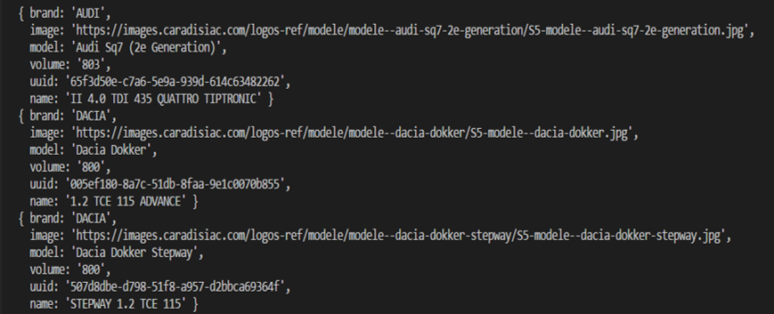
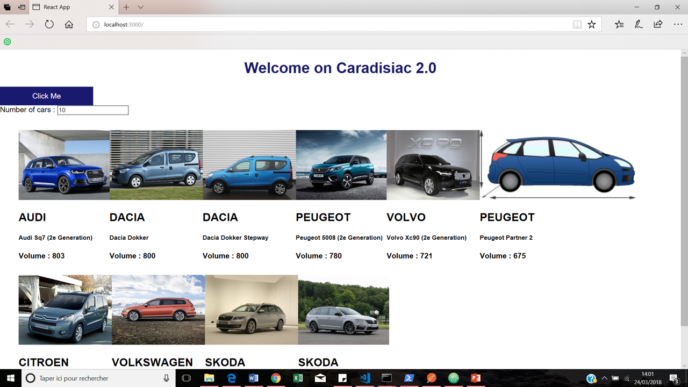

# CARADISIAC

> Drive comfortably 

<!-- START doctoc generated TOC please keep comment here to allow auto update -->
<!-- DON'T EDIT THIS SECTION, INSTEAD RE-RUN doctoc TO UPDATE -->
**Table of Contents**  *generated with [DocToc](https://github.com/thlorenz/doctoc)*

- [Introduction](#introduction)
- [Installation](#installation)
- [Usage](#usage)
  - [API](#api)
  - [REACT](#react)

<!-- END doctoc generated TOC please keep comment here to allow auto update -->

## Introduction

[caradisiac.com](http://www.caradisiac.com/fiches-techniques) provides a tone of technical records related to car specification.

Inside this project, there is 2 directory : 
* [backend-node-api](./backend-node-api) : to make request on elasticSearch 
* [frontend-react](./frontend-react) : to make a web app with react

## Installation 

* Lauch the server of ElasticSearch on port 9200
* Go to yours repositories
* Install the dependencies 
* Run the projects

Firstly : 
``` sh
> cd /path/caradisiac/backend-node-api
> npm install
> npm start
```
It opens the api on port 9292 and adding connection to http://localhost:9200/ (ElasticSearch)

Then : 

``` sh
> cd /path/caradisiac/frontend-react
> npm install
> npm start
```
It starts the development server. You can now view the project react in the browser

## Usage

### API

You have __2 Endpoints__ to request the API : 
* __/populate__ : get all records from Caradisiac and index to ElasticSearch
* __/cars__ : return a JSON list of models with the higher volume. With the parameter ?nbr you can choose the number of cars returned. 

<p align=center>
    
</p>


### REACT

This is the browser : 

<p align=center>
    
</p>

You can choose the number of cars returned (by default is 10) and click on the button. 

<br />
<br />

Powered by Aurelie Jolas